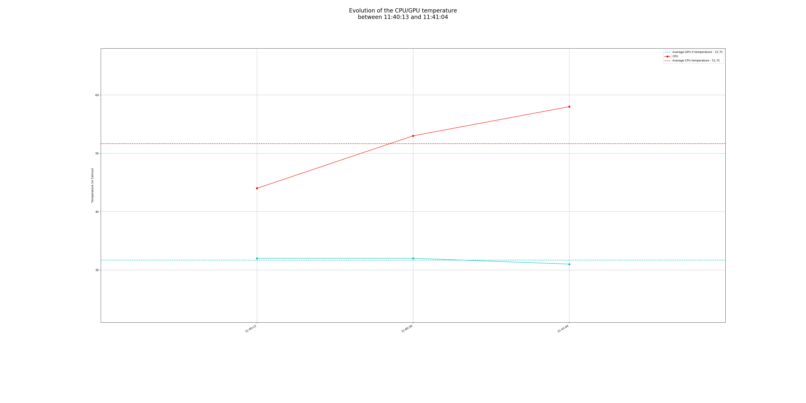

# hardward stress test & temperature log

## install

```
./install.sh
pip3 install -r requirements.txt
```

##results


## usage

### CPU & memory & HDD stress

```
./hardward_test.sh
```

### gpu stress

__you must install cuda & pytorch__


```
./gpu_test.py
```

### plot_temperatures

```
./coretemp.py
```
